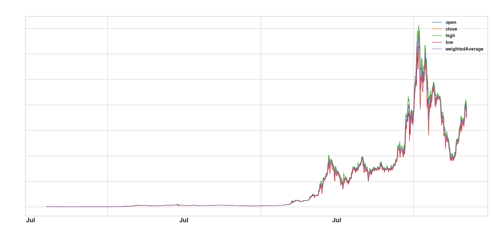
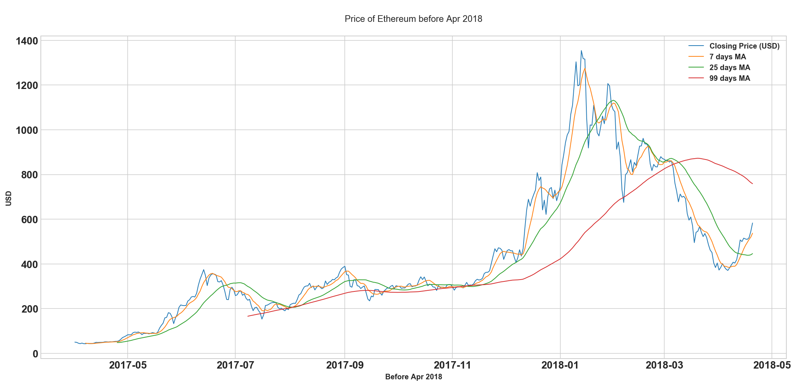
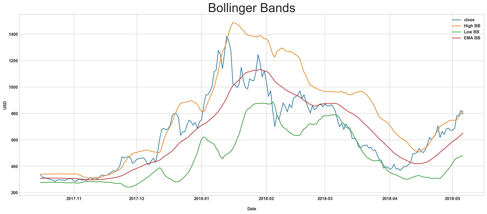
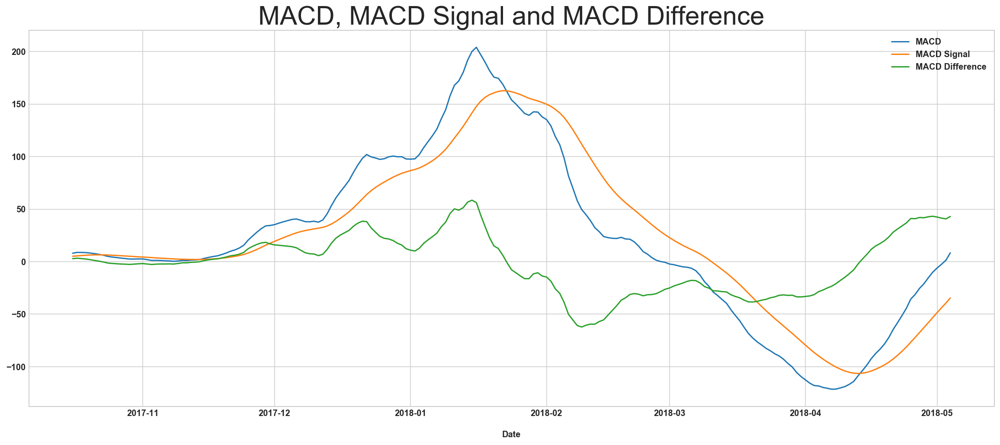
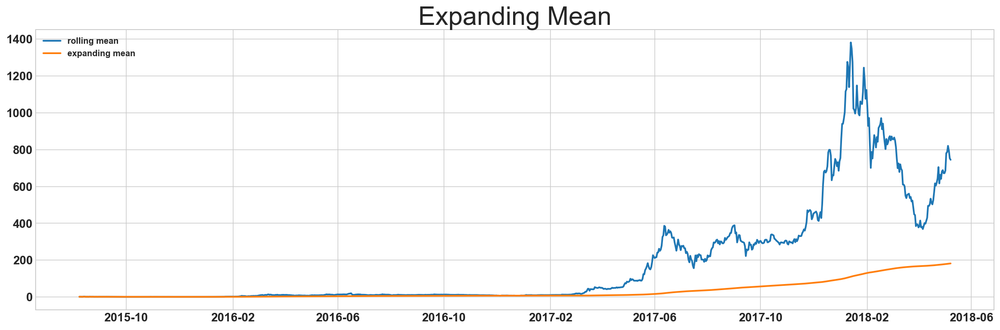
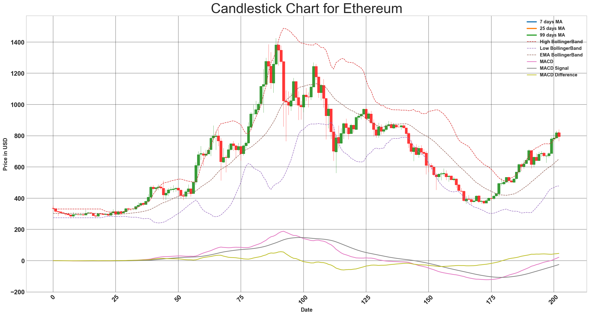
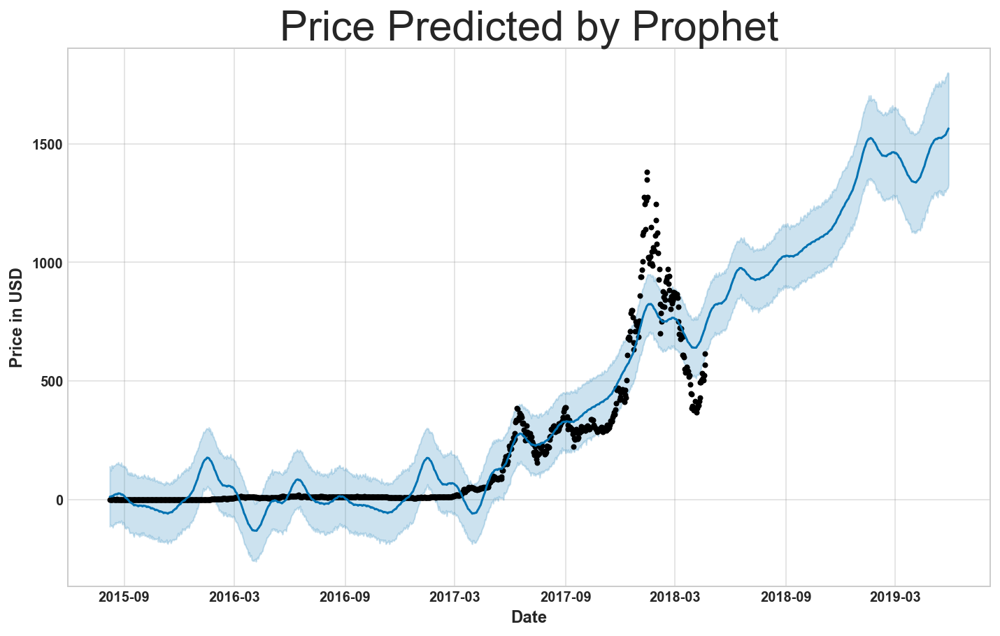

# Analysing Using Technical Analysis

## Disclaimer
The following content is intended for educational purpose only. Please check with your authorised broker for advice.


```python
#Plot Day Open, Close, High, Low and WeightedAverage
plt.rcParams["font.weight"] = "bold"
plt.rcParams["axes.labelweight"] = "bold"

full_data[['open','close','high','low','weightedAverage']].plot(lw=1, figsize=(18,8), fontsize=14)

plt.ylabel('USD', color='white')
plt.xlabel('\nDate', color='white')
plt.xticks(color='white')
plt.yticks(color='white')
plt.title('Ethereum Price\n', color='white')
plt.show
```





```python
#Calculate the rolling mean of years without centering
#Window=7, 25, 99
yearly_w7 = data['close'].resample('D').mean().rolling(window=7, center=False).mean()
yearly_w25 = data['close'].resample('D').mean().rolling(window=25, center=False).mean()
yearly_w99 = data['close'].resample('D').mean().rolling(window=99, center=False).mean()
```


```python
plt.figure(figsize=(18,8))

plt.plot(date_ticks_orig, data.weightedAverage.values,lw=1, label='Closing Price (USD)')
plt.plot(date_ticks_roll, yearly_w7.values, lw=1, label='7 days MA')
plt.plot(date_ticks_roll, yearly_w25.values, lw=1, label='25 days MA')
plt.plot(date_ticks_roll, yearly_w99.values, lw=1, label='99 days MA')

plt.legend()
plt.ylabel('USD')
plt.xlabel('Before Apr 2018')
plt.title('\nPrice of Ethereum before Apr 2018\n')
plt.tick_params(labelsize=14)
```





## Bollinger Band - Volatility Indicator
(Wikipedia) Bollinger Bands is a financial trading tool that is used to define the prevailing high and low prices in a market to characterize the trading band of a financial instrument or commodity. Bollinger Bands are a volatility indicator similar to the Keltner channel.

Bollinger Bands consist of a N-period moving average (MA), an upper band at K times an N-period standard deviation above the moving average (MA + Kσ), and a lower band at K times an N-period standard deviation below the moving average (MA − Kσ)

Typical values for N and K are 20 and 2, respectively. The default choice for the average is a simple moving average, but other types of averages can be employed as needed. Exponential moving averages are a common second choice. Usually the same period is used for both the middle band and the calculation of standard deviation.


```python
#Plotting Bollinger Band
fig = plt.figure(figsize=(20, 8))
plt.plot(full_data[800:1003].close)
plt.plot(full_data[800:1003].volatility2, label='High BB')
plt.plot(full_data[800:1003].volatility3, label='Low BB')
plt.plot(full_data[800:1003].volatility4, label='EMA BB')
plt.title('Bollinger Bands', fontsize=30)
plt.legend()
plt.savefig("bb.png")
plt.ylabel('USD')
plt.xlabel('\nDate')
plt.show
```


    <function matplotlib.pyplot.show(*args, **kw)>





## Moving Average Convergence Divergence (MACD) - Trend Indicator
Wikiepedia - MACD, short for moving average convergence/divergence, is a trading indicator used in technical analysis of stock prices, created by Gerald Appel in the late 1970s. It is supposed to reveal changes in the strength, direction, momentum, and duration of a trend in a stock's price.

The MACD indicator (or "oscillator") is a collection of three time series calculated from historical price data, most often the closing price. These three series are: the MACD series proper, the "signal" or "average" series, and the "divergence" series which is the difference between the two. The MACD series is the difference between a "fast" (short period) exponential moving average (EMA), and a "slow" (longer period) EMA of the price series. The average series is an EMA of the MACD series itself.


```python
# Generate MACD image
fig = plt.figure(figsize=(20, 8))
plt.plot(full_data[800:1001].trend1, label='MACD')
plt.plot(full_data[800:1001].trend2, label='MACD Signal')
plt.plot(full_data[800:1001].trend3, label='MACD Difference')
plt.title('MACD, MACD Signal and MACD Difference', fontsize=30)
plt.legend()
plt.savefig("macd.png")
plt.xlabel('\nDate')
plt.show
```


    <function matplotlib.pyplot.show(*args, **kw)>





## Expanding Mean
This looks like a good baseline.


```python
#Expanding Mean by 24H since my data is in 24H
date_ticks = full_data.index

rolling_mean = full_data.close.resample('24H').sum().rolling(window=1, center=False).mean()
expanding_mean = full_data.close.resample('24H').sum().expanding().mean()

plt.figure(figsize=(20,6))

plt.plot(date_ticks, rolling_mean, alpha=1, lw=2, label='rolling mean')
plt.plot(date_ticks, expanding_mean, alpha=1, lw=2, label='expanding mean')
plt.title('Expanding Mean', fontsize=30)
plt.legend(loc='upper left')

plt.tick_params(labelsize=14)
```





```python
#Plotting Candlesticks with Moving Average
# Plot Candlesticks for the last 203 days, on data2, with date label

from pandas_datareader import data
import matplotlib.pyplot as plt
from mpl_finance import candlestick2_ohlc
import matplotlib.pyplot as plt
import matplotlib.ticker as ticker
import datetime as datetime

data3=full_data[800:1003].copy()
#data3.set_index('date', inplace=True)

data3 = add_all_ta_features(data3, "close", "high", "low", "open", "volume",fillna=True)

data3['MA7'] = data2[793:1003]["close"].rolling(7).mean()
data3['MA25'] = data2[775:1003]["close"].rolling(25).mean()
data3['MA99'] = data2[701:1003]["close"].rolling(99).mean()
data3['MA200'] = data2[600:1003]["close"].rolling(200).mean()
data3.reset_index(inplace=True)

fig, ax = plt.subplots(figsize=(20,12))

#Plotting Moving Average
candlestick2_ohlc(ax, data3.open,data3.high,data3.low,data3.close, width=1, colorup='g')
data3.MA7.plot(ax=ax,label='7 days MA',lw=2.5)
data3.MA25.plot(ax=ax,label='25 days MA',lw=2.5)
data3.MA99.plot(ax=ax,label='99 days MA',lw=2.5)
#data3.MA200.plot(ax=ax,label='200 days MA',lw=2.5)

#Plotting Bollinger Band
plt.plot(data3.volatility2, label='High BollingerBand',lw=1,ls='--')
plt.plot(data3.volatility3, label='Low BollingerBand',lw=1,ls='--')
plt.plot(data3.volatility4, label='EMA BollingerBand',lw=1,ls='--')

#Plotting MACD Indicator
plt.plot(data3.trend1, label='MACD')
plt.plot(data3.trend2, label='MACD Signal')
plt.plot(data3.trend3, label='MACD Difference')

plt.subplots_adjust(left=0.09, bottom=0.20, right=0.94, top=0.90, wspace=0.2, hspace=0)
plt.tick_params(labelsize=14)
plt.xticks(rotation = 45)
plt.xlabel("Date", fontsize=12)
plt.ylabel("Price in USD", fontsize=12)
plt.legend()
plt.title("Candlestick Chart for Ethereum", fontsize=30)
ax.grid(False, color = 'k', alpha = 0.5)


m.plot(forecast);
plt.xlabel("Date", fontsize=12)
plt.ylabel("Price in USD", fontsize=12)
plt.title("Price Predicted by Prophet", fontsize=30)
plt.show()
```







