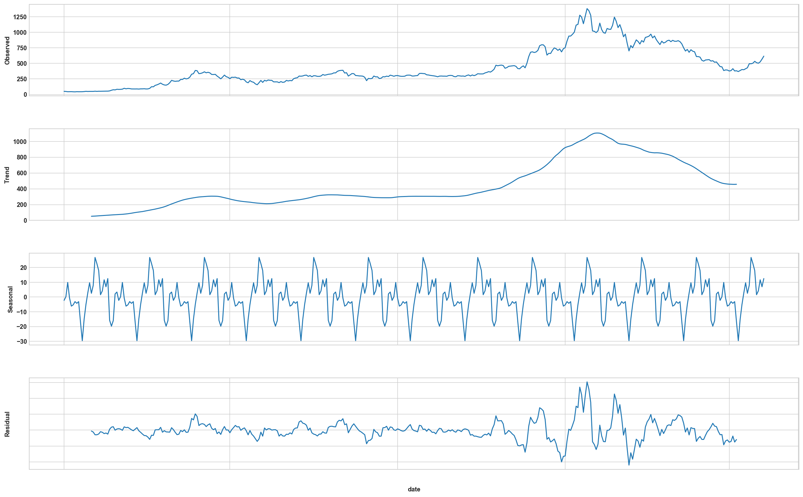
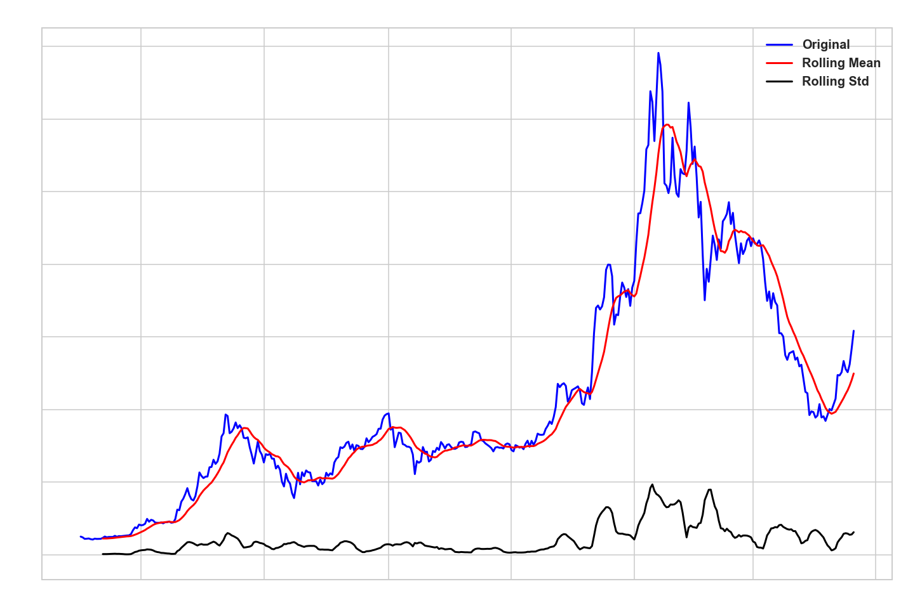
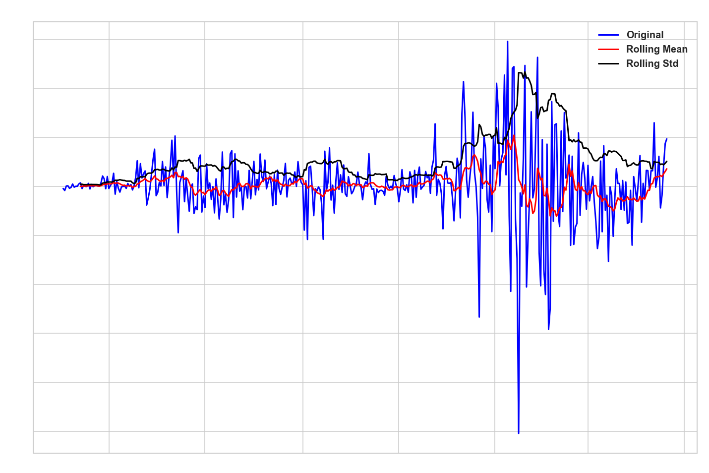
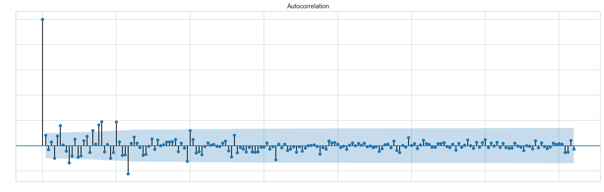
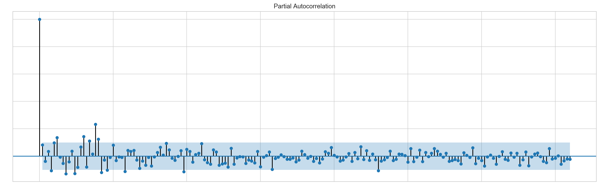
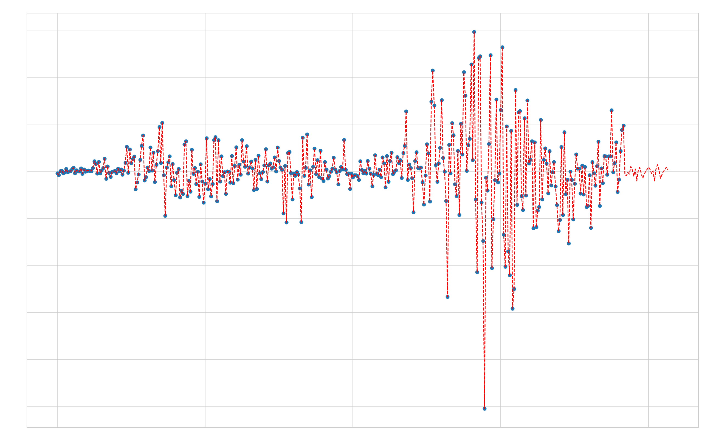
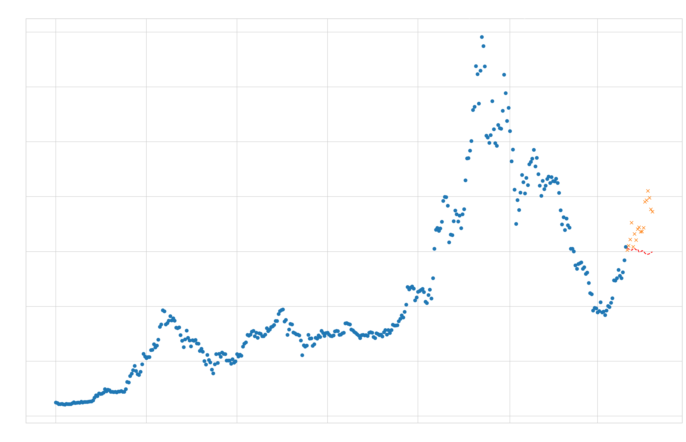

# Predicting Price of Ethereum Using Time Series
## Disclaimer
The following content is intended for educational purpose only. Please check with your authorised broker for advice.

## Time Series Decomposition function in Python


```python
decomposition = seasonal_decompose(data['close'], freq=30)  

plt.rcParams["font.weight"] = "bold"
plt.rcParams["axes.labelweight"] = "bold"
fig = plt.figure()  

fig = decomposition.plot()  
#plt.title('Decomposition of Ethereum Price\n', color='white')
fig.set_size_inches(20, 13)
plt.xticks(color='white')
plt.yticks(color='white')
plt.show
```


    <function matplotlib.pyplot.show(*args, **kw)>


    <Figure size 432x288 with 0 Axes>





## Dickey-Fuller test of stationarity


```python
# perform test
test_stationarity(data['close'])
```





    Results of Dickey-Fuller Test:
    Test Statistic                  -1.570061
    p-value                          0.498613
    #Lags Used                      17.000000
    Number of Observations Used    367.000000
    Critical Value (5%)             -2.869448
    Critical Value (10%)            -2.570983
    Critical Value (1%)             -3.448294
    dtype: float64


### Difference the Closing Price to remove trend in time series (detrend) and approach stationarity
Perform test on the first-differenced timeseries


```python
# first difference
data['close_diff'] = data['close'] - data['close'].shift(1) 
test_stationarity(data.close_diff.dropna(inplace=False))
```





    Results of Dickey-Fuller Test:
    Test Statistic                  -4.238664
    p-value                          0.000566
    #Lags Used                      16.000000
    Number of Observations Used    367.000000
    Critical Value (5%)             -2.869448
    Critical Value (10%)            -2.570983
    Critical Value (1%)             -3.448294
    dtype: float64


## The Autocorrelation Function (ACF)
#to see if the time series is random or not, part of EDA


```python
from statsmodels.tsa.stattools import acf
from statsmodels.graphics.tsaplots import plot_acf
from statsmodels.tsa.stattools import pacf
from statsmodels.graphics.tsaplots import plot_pacf
```


```python
#ACF plot - correlation at increasing lags (till 6 months)
fig, ax = plt.subplots(figsize=(20,6))
plt.rcParams["font.weight"] = "bold"
plt.rcParams["axes.labelweight"] = "bold"
plot_acf(udiff.values, lags=180, ax=ax)
plt.xticks(color='white')
plt.yticks(color='white')
plt.show()
```





```python
#PACF plot - correlation at a given lag controlling for the effect of previous lags (till 6 months)
fig, ax = plt.subplots(figsize=(20,6))
plt.rcParams["font.weight"] = "bold"
plt.rcParams["axes.labelweight"] = "bold"
plot_pacf(udiff.values, lags=180, ax=ax)
plt.xticks(color='white')
plt.yticks(color='white')
plt.show()
```





```python
pacf(udiff.values)
```


    array([ 1.        ,  0.08271478, -0.03794538,  0.03549169, -0.10743992,
            0.09964228,  0.13844346, -0.00790333, -0.05431749, -0.13178335,
           -0.04202212,  0.03903059, -0.13117787, -0.08351946,  0.07074765,
            0.15020544, -0.08193232,  0.11625125,  0.01690162,  0.24740603,
            0.13371616, -0.12866159, -0.03000453, -0.10977782, -0.01038885,
            0.08650342, -0.0360247 , -0.00619986, -0.00823221, -0.12358127,
            0.04736659,  0.03956227,  0.04783842, -0.02886175, -0.10215186,
           -0.04062918, -0.07384614, -0.00950218, -0.08040306, -0.00636778,
            0.03141115])


### Finding Optimal Parameters Using Auto ARIMA


```python
### Auto ARIMA
from statsmodels.tsa.arima_model import ARMA
from pyramid.arima import ARIMA
from pyramid.arima import auto_arima

#fitting a stepwise model:
from pyramid.arima import auto_arima

stepwise_fit = auto_arima(udiff.values, 
                          start_p=1, start_q=1, 
                          max_p=3, max_q=3, m=12,
                          start_P=0, seasonal=True, d=1, D=1, 
                          trace=True,
                          error_action='ignore',
                          suppress_warnings=True,
                          stepwise=True)

stepwise_fit.summary()
```


```python
#Using optimal parameters: order=(1, 1, 1) seasonal_order=(1, 1, 1, 12)
output = udiff.values
model = sm.tsa.statespace.SARIMAX(output, order=(1,1,1), seasonal_order=(1,1,1,12))
res = model.fit()
res.summary()
```


<table class="simpletable">
<caption>Statespace Model Results</caption>
<tr>
  <th>Dep. Variable:</th>                  <td>y</td>               <th>  No. Observations:  </th>    <td>384</td>   
</tr>
<tr>
  <th>Model:</th>           <td>SARIMAX(1, 1, 1)x(1, 1, 1, 12)</td> <th>  Log Likelihood     </th> <td>-1890.453</td>
</tr>
<tr>
  <th>Date:</th>                   <td>Thu, 17 May 2018</td>        <th>  AIC                </th> <td>3790.905</td> 
</tr>
<tr>
  <th>Time:</th>                       <td>23:28:03</td>            <th>  BIC                </th> <td>3810.658</td> 
</tr>
<tr>
  <th>Sample:</th>                         <td>0</td>               <th>  HQIC               </th> <td>3798.740</td> 
</tr>
<tr>
  <th></th>                             <td> - 384</td>             <th>                     </th>     <td> </td>    
</tr>
<tr>
  <th>Covariance Type:</th>               <td>opg</td>              <th>                     </th>     <td> </td>    
</tr>
</table>
<table class="simpletable">
<tr>
      <td></td>        <th>coef</th>     <th>std err</th>      <th>z</th>      <th>P>|z|</th>  <th>[0.025</th>    <th>0.975]</th>  
</tr>
<tr>
  <th>ar.L1</th>    <td>    0.0829</td> <td>    0.034</td> <td>    2.463</td> <td> 0.014</td> <td>    0.017</td> <td>    0.149</td>
</tr>
<tr>
  <th>ma.L1</th>    <td>   -0.9988</td> <td>    0.072</td> <td>  -13.803</td> <td> 0.000</td> <td>   -1.141</td> <td>   -0.857</td>
</tr>
<tr>
  <th>ar.S.L12</th> <td>   -0.0754</td> <td>    0.037</td> <td>   -2.044</td> <td> 0.041</td> <td>   -0.148</td> <td>   -0.003</td>
</tr>
<tr>
  <th>ma.S.L12</th> <td>   -0.9985</td> <td>    1.417</td> <td>   -0.705</td> <td> 0.481</td> <td>   -3.775</td> <td>    1.778</td>
</tr>
<tr>
  <th>sigma2</th>   <td> 1354.5950</td> <td> 1896.632</td> <td>    0.714</td> <td> 0.475</td> <td>-2362.735</td> <td> 5071.925</td>
</tr>
</table>
<table class="simpletable">
<tr>
  <th>Ljung-Box (Q):</th>          <td>123.73</td> <th>  Jarque-Bera (JB):  </th> <td>1098.91</td>
</tr>
<tr>
  <th>Prob(Q):</th>                 <td>0.00</td>  <th>  Prob(JB):          </th>  <td>0.00</td>  
</tr>
<tr>
  <th>Heteroskedasticity (H):</th>  <td>12.71</td> <th>  Skew:              </th>  <td>-0.92</td> 
</tr>
<tr>
  <th>Prob(H) (two-sided):</th>     <td>0.00</td>  <th>  Kurtosis:          </th>  <td>11.23</td> 
</tr>
</table>


### Forecasting With ARIMA


```python
#Forecast for next 30 days with SARIMA: order=(1, 1, 1) seasonal_order=(1, 1, 1, 12)

res = model.fit()
preds = res.forecast(30)
fcast = np.concatenate((output, preds), axis=0)

plt.rcParams["font.weight"] = "bold"
plt.rcParams["axes.labelweight"] = "bold"
plt.figure(figsize=(20,15));
plt.plot(output, 'o' , fcast, 'r--');
plt.xlabel("Date", fontsize=12, color='white')
plt.ylabel("USD", fontsize=12, color='white')
plt.title("Residual Prediction for Ethereum for Next 18 Days", fontsize=15, color='white')
#plt.title('RSS: %.4f'% sum((res.fittedvalues-udiff)**2))
plt.subplots_adjust(left=0.09, bottom=0.20, right=0.94, top=0.90, wspace=0.2, hspace=0)
plt.xticks(color='white')
plt.yticks(color='white')
plt.show()
```





```python
#Predicted residuals for the next 30 days
preds
```


    array([ -3.51230722,  -4.69004046,  -1.17441407,  -2.97712228,
             5.01201935,   1.4554185 ,  -5.11988352,   2.42920673,
           -10.2626658 ,   0.9091936 ,   4.15184051,  -1.97461956,
            -7.60382966,  -3.57428629,  -0.02163875,   2.02961593,
             4.45750797,   1.89710025,  -2.53266988,   0.47896301,
           -10.26524539,   2.35494836,   7.02837909,   1.72000064,
            -7.4094668 ,  -3.77236197,  -0.22250447,   1.53830212,
             4.38530933,   1.74982502])


#Plotting Actual Price vs Prediction


```python
plt.figure(figsize=(20,15));
plt.plot(train_actual, 'o' , AVP['yhat'], 'r--',AVP['close'], 'x');
plt.xlabel("Date", fontsize=12, color='white')
plt.ylabel("USD", fontsize=12, color='white')
plt.title("Residual Prediction for Ethereum for Next 30 Days Using ARIMA", fontsize=30, color='white')
plt.subplots_adjust(left=0.09, bottom=0.20, right=0.94, top=0.90, wspace=0.2, hspace=0)
plt.xticks(color='white')
plt.yticks(color='white')
plt.show()
```





### Checking Mean Squared Error (MSE) for ARIMA


```python
from sklearn.metrics import mean_squared_error
arima_mse = mean_squared_error(AVP['close'], AVP['yhat'])
arima_mse
```


    14493.33433894056


